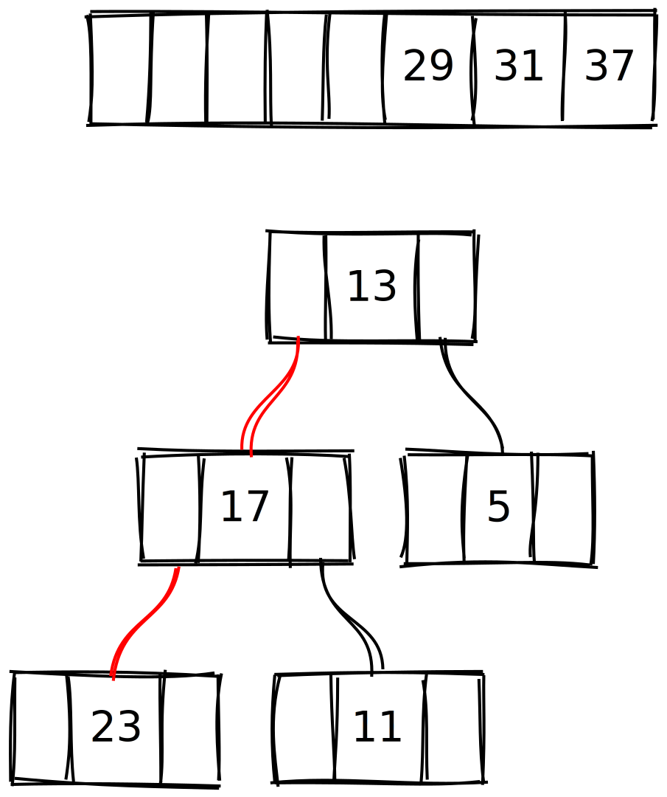

# Weak Heaps <!-- .element: style="text-transform: none" -->

#### Aaditya (Sonny) Bhatia
#### 28 November 2022
#### COT 5405 (Fall 2022)

<audio data-autoplay data-src="./audio/01.mp4" />
<!-- .slide: data-autoslide="7500" -->

---

## Outline

- Background
- What is Weak Heap?
- Merge Operation
- Data Structure
- Sort Algorithm
- Improvements to Sort
- References

<audio data-autoplay data-src="./audio/02.mp4" />
<!-- .slide: data-autoslide="29500" -->

---

## Background

- Published in 1993
- Ronald D. Dutton
  - Professor (Retd.), Dept of Computer Science, UCF
- Improved worst case and average run times for a variant of heapsort

<audio data-autoplay data-src="./audio/03.mp4" />
<!-- .slide: data-autoslide="21000" -->

---

## What is Weak Heap?

- Node ≥ all children on the right
  - left subtree can have larger values

- Root --> no left subtree
  - Root = largest value

- Every node has two children, except-
  - Bottom two levels
  - Root!

<audio data-autoplay data-src="./audio/04.mp4" />
<!-- .slide: data-autoslide="94500" -->

Notes:

A heap with relaxed rules.

## Difference from Regular Heap

- bottom nodes not left flushed
- node unrelated to its left subtree

- These conditions guarantee root has largest value

---

## Merge Operation

1. New root = Root node with larger value

2. Right child = Root node with smaller value

3. Left child of right child = Larger root's subtree
- #3 only satisfied for "compatible" weak heaps

<audio data-autoplay data-src="./audio/05.mp4" />
<!-- .slide: data-autoslide="111000" -->

Notes:

This will always satisfy condition #1 and #2.

Condition #3 only satisfied for "compatible" weak heaps
- depth of sparse nodes of each must be consecutive numbers

---

## Example: Merging Weak Heaps

	

		

		

	

	

		

		

	

	

		

		

	

	

		

		

		

	

	

		

		

	

	

		

		

	

	

		
	

	

		
	

<audio data-autoplay data-src="./audio/06.mp4" />
<!-- .slide: data-autoslide="100" -->

---

## Array Representation

	

  - Breadth First Allocation
  - $i_{root} = 0$
  - $i_{firstChild} = 1$
  - $child_{left} = 2i$
  - $child_{right} = 2i + 1$

	

	

		
		
	

<audio data-autoplay data-src="./audio/07.ogg" />
<!-- .slide: data-autoslide="35000" -->

---

## Array Representation: Reverse Bit

	

- Indicator Variable
- One additional bit per element
- $i_{root} = 0$
- $i_{child} = 1$
- $child_{left} = 2i + Reverse[i]$
- $child_{right} = 2i + 1 - Reverse[i]$
- To swap subtrees, flip `Reverse` bit
	- Fewer movements!

	

	

		
		
	

<audio data-autoplay data-src="./audio/08.ogg" />
<!-- .slide: data-autoslide="60000" -->

Notes:

Here we introduce a new concept called Reverse Bit.

- one bit variable for each node that indicates the orientation of its children in the underlying array.  In this example, a value of zero indicates normal orientation while 1 indicates reversed.

- To swap the left and right subtrees of a node, simply flip the parent's bit

- in the example on top, 29 has its children 31 and 17 oriented normally
- in the lower heap, 17 and 31 were swapped, but the reverse bit is set to 1, 31 is still the left child of 29 and therefore does not violate the first weak heap property.

- since weak heap merge operations involve swapping children so often, using a bit to indicate orientation allows us to do so by flipping just one bit, which is far more efficient than moving complex objects in memory.

---

## Weak Heap Sort

1. Construct a weak heap
2. Remove the root
3. Merge remaining forest of weak heaps
	- far-left edge
4. Repeat #2 and #3

Notes:

Root is the largest value

<audio data-autoplay data-src="./audio/09.mp4" />
<!-- .slide: data-autoslide="43000" -->

---

## Example: Sort

	

		

	

	

		

	

	

		

	

	

		

	

	

		

	

	

		

	

	

		

	

	

		

	

	

		

	

	

		

	

	

		

	

	

		

	

	

		

	

	

		

	

	

		

	

	

		

	

	

		

	

	

		

	

	

		

	

	

		

	

	

		

	

	

		

	

	

		

	

	

		

	

	

		

	

	

		

	

	

		

	

	

		

	

	

		

	

	

		

	

<audio data-autoplay data-src="./audio/10.ogg" />
<!-- .slide: data-autoslide="100" -->

---

## Improvements to Sort

- Reduced number of comparisons
  - Relax heap property
  - No traversing the tree!
- In-place operations due to `Reverse` bit
- Very consistent worst-case performance!
  - $(n - 1)log n + 0.086013n$
- Expected performance comparable to QuickSort
  - Estimated at $(n - 0.5) log n - 0.413n$

<audio data-autoplay data-src="./audio/11.mp4" />
<!-- .slide: data-autoslide="52000" -->

---

## References

- Dutton, R. D. (1993). Weak-heap sort. BIT, 33(3), 372–381. https://doi.org/10.1007/BF01990520
- Edelkamp, S., Elmasry, A., & Katajainen, J. (2012). The weak-heap data structure: Variants and applications. Journal of Discrete Algorithms, 16, 187–205. https://doi.org/10.1016/j.jda.2012.04.010
- Edelkamp, S., Elmasry, A., Katajainen, J., & Weiß, A. (2013). Weak Heaps and Friends: Recent Developments. In T. Lecroq & L. Mouchard (Eds.), Combinatorial Algorithms (Vol. 8288, pp. 1–6). Springer Berlin Heidelberg. https://doi.org/10.1007/978-3-642-45278-9_1

<audio data-autoplay data-src="./audio/12.mp4" />
